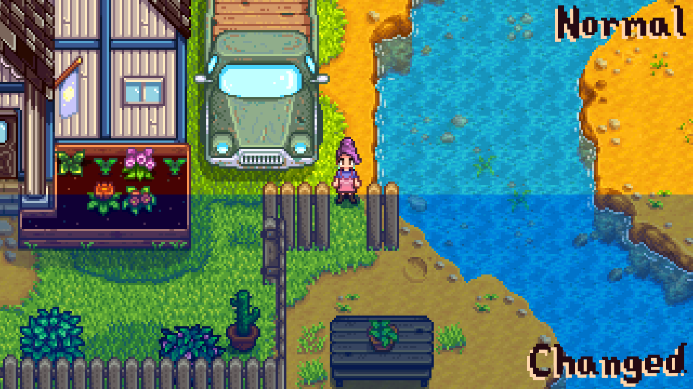
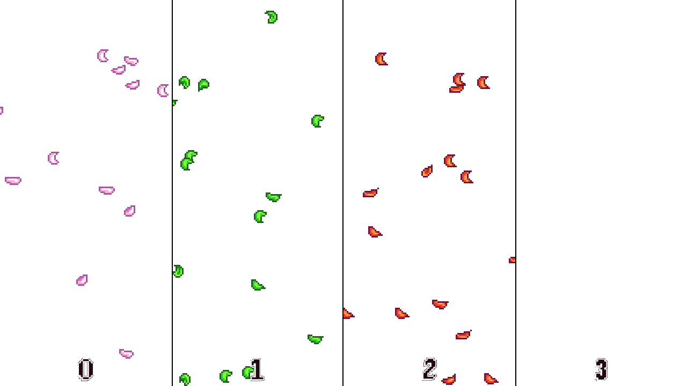
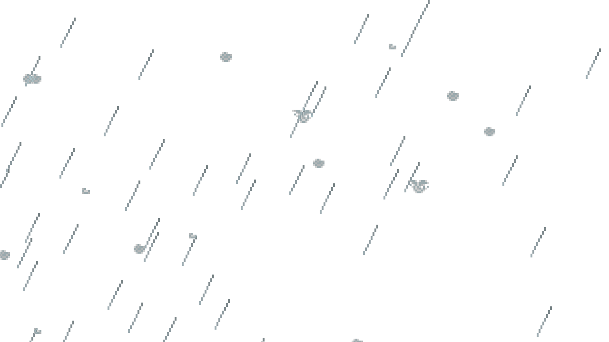
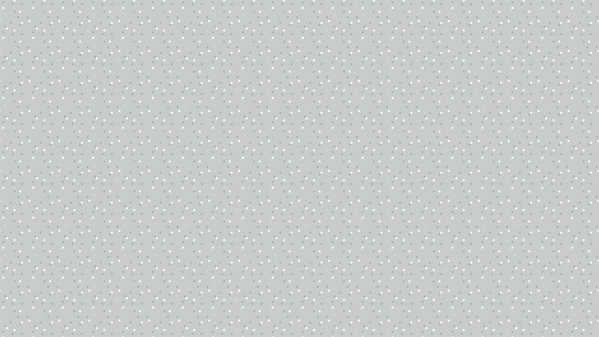

← [README](README.md)

Well, look who blew in. Howdy, farmer! Looking to make some custom weather
types for your mod? You've come to the right place!


## Contents

* [Getting Started](#getting-started)
* [What is a Weather Type?](#what-is-a-weather-type)
* [What is a Weather Flag?](#what-is-a-weather-flag)
* [Custom Weather Type](#custom-weather-type)
* [Screen Tint](#screen-tint)
* [Effects](#effects)
  * [Buff](#buff)
  * [Modify Health](#modifyhealth)
  * [Modify Stamina](#modifystamina)
  * [Trigger](#trigger)
* [Layers](#layers)
  * [Color](#color)
  * [Debris](#debris)
  * [Rain](#rain)
  * [Snow / Texture Scroll](#snow--texturescroll)
* [How Do I Make My Weather Happen?](#how-do-i-make-my-weather-happen)
  * [Custom Weather Totems](#custom-weather-totems)
* [Location Context Extension Data](#location-context-extension-data)
* [Commands](#commands)
* [Mod Data / Custom Fields](#mod-data-custom-fields)
* [Game State Queries](#game-state-queries)
* [Content Patcher Tokens](#content-patcher-tokens)


## Getting Started

Cloudy Skies does not currently support content packs of its own. Instead, I
expect you to use [Content Patcher](https://www.nexusmods.com/stardewvalley/mods/1915)
to load your custom data.

> Don't know how to use Content Patcher? Head over to check out their
> [excellent documentation](https://github.com/Pathoschild/StardewMods/blob/stable/ContentPatcher/docs/author-guide.md#readme)
> then! They do a much better job than I ever could.

Specifically, you'll be loading textures and using the `EditData` action with
the target:
```
Mods/leclair.cloudyskies/WeatherData
```


## What is a Weather Type?

A weather type is, if you'll forgive the tautology, a type of weather. The base
game has eight weather types:

* `Sun`
* `Rain`
* `Wind`
* `Storm`
* `Snow`
* `Festival`
* `Wedding`
* (and one added in 1.6, not named because it's a spoiler)

Really though, it's more like six. `Festival` and `Wedding` are both duplicates
of `Sun`, just with a little flavor for the occasion.

The Stardew 1.6 update added the ability to use custom Ids for the
weather, but it didn't make it possible to actually *do anything* with those
custom Ids. That's what this mod is for.

In so far as this mod is concerned, a weather type is any behavior associated
with a specific weather flag or weather Id. We make it possible to set up
a lot of those behaviors, and set up the necessary data for other mods to
contribute their own behaviors. (As an example, you could use FTM to spawn
custom foragables in certain weather.)


## What is a Weather Flag?

A weather flag is slightly different than a weather type. Internally, the
game has flags it checks rather than directly looking at the current
weather type's Id. These flags are pretty self explanatory:

* `IsRaining`
* `IsSnowing`
* `IsLightning`
* `IsDebrisWeather` (Debris is the internal name for Wind)
* (and one added in 1.6, not named because it's a spoiler)

The `Storm` weather, for example, sets both the `IsRaining` and
`IsLightning` flags to be true.


## Custom Weather Type

Alright, awesome! So how do you *make a custom weather type*? Glad you asked!
You just need to add an entry to the `Mods/leclair.cloudyskies/WeatherData`
asset with your new weather type's unique Id, and any other data to go with it.

Specifically, each custom weather type supports the following properties:

<table>
<tr>
<th>Field</th>
<th>Description</th>
</tr>
<tr><th colspan=2>Identity</th></tr>
<tr>
<td><code>Id</code></td>
<td>

**Required.** The unique Id of your weather type. This must be unique, and is
used elsewhere to reference this specific weather type.

You should include your mod's Unique Id in this for best results to ensure
there aren't any collisions. When using Content Patcher, you can do this
easily using the `{{ModId}}` token. Example: `{{ModId}}_Sandstorm`

</td>
</tr>
<tr>
<td><code>DisplayName</code></td>
<td>

**Required.** A human readable name to display to the player when this weather
type is referenced by name. This is a [tokenizable string](https://stardewvalleywiki.com/Modding:Tokenizable_strings).

</td>
</tr>
<tr><th colspan=2>Icon</th></tr>
<tr>
<td><code>IconTexture</code></td>
<td>

*Optional.* The name of a texture containing this weather type's icon. The
icon is displayed on the in-game HUD next to the clock when this is the
active weather type in the current location. This may also be used by
other mods, such as UI Info Suite or Almanac.

This should be a texture you've loaded. As an example, you could use
the value `Mods/{{ModId}}/SandstormIcon` and then elsewhere have
the content block:

`{
	"Action": "Load",
	"Target": "Mods/{{ModId}}/SandstormIcon",
	"FromFile": "assets/SandstormIcon.png"
}`

</td>
</tr>
<tr>
<td><code>IconSource</code></td>
<td>

*Optional.* The top-left corner of your weather's icon in the provided
texture. You only supply the X and Y position. An icon is always 12 by 8 pixels.

Default: `{"X": 0, "Y": 0}`

</td>
</tr>
<tr><th colspan=2>Television</th></tr>
<tr>
<td><code>TVTexture</code></td>
<td>

*Optional.* The name of a texture containing this weather type's TV animation.
The animation may be displayed when a player checks the forecast using their
television. This may also be used by other mods.

Like `IconTexture`, this should be a texture you've loaded. It can even be
the same texture, if you use `TVSource` and `IconSource`.

</td>
</tr>
<tr>
<td><code>TVSource</code></td>
<td>

*Optional.* The top-left corner of the first frame of your weather type's TV
animation. Each frame is always 13 by 13 pixels, and the frames are always
laid out as a horizontal strip.

Default: `{"X": 0, "Y": 0}`

</td>
</tr>
<tr>
<td><code>TVFrames</code></td>
<td>

*Optional.* The number of frames your weather type's TV animation has.

Default: `4`

</td>
</tr>
<tr>
<td><code>Forecast</code></td>
<td>

*Optional.* The message to display to the player when they check the
forecast using their TV and this weather type is coming up.
This is a [tokenizable string](https://stardewvalleywiki.com/Modding:Tokenizable_strings).

Example: `"Winds across the desert have blown up thick clouds of sand. Best to stay inside if you can."`

</td>
</tr>
<tr>
<td><code>ForecastByContext</code></td>
<td>

*Optional.* A dictionary letting you override the `Forecast` string for
specific location contexts. This is an object where each key is the Id
of a location context, and the value is a `Forecast` for that context.

Example: `{"Island": "A cloud of dust is blowing towards the island from a desert on a far off continent."}`

</td>
</tr>
<tr><th colspan=2>Weather Totem Behavior</th></tr>
<tr>
<td><code>TotemMessage</code></td>
<td>

*Optional.* A message to display to the player when they use a custom weather
totem for this weather type. If this is not set, the default message used
by the base game's Rain Totem will appear.
This is a [tokenizable string](https://stardewvalleywiki.com/Modding:Tokenizable_strings).

</td>
</tr>
<tr>
<td><code>TotemSound</code></td>
<td>

*Optional.* An [audio cue](https://stardewvalleywiki.com/Modding:Audio) to
play when the player uses a custom weather totem for this weather type. If
this is not set, no sound will play. The base game's Rain Totem uses the
sound: `thunder`

</td>
</tr>
<tr>
<td><code>TotemAfterSound</code></td>
<td>

*Optional.* An [audio cue](https://stardewvalleywiki.com/Modding:Audio) to
play after the player uses a custom weather totem for this weather type. This
plays approximately two seconds after `TotemSound`. If this is not set, no
sound will play. The base game's Rain Totem uses the sound: `rainsound`

</td>
</tr>
<tr>
<td><code>TotemScreenTint</code></td>
<td>

*Optional.* A color to flash the screen when the player uses a custom weather
totem for this weather type. If this is not set, the screen will not flash a
color. The base game's Rain Totem uses the color: `slateblue`

</td>
</tr>
<tr>
<td><code>TotemParticleTexture</code></td>
<td>

*Optional.* The texture name of a texture to display as particles when the
player uses a custom weather totem for this weather type. If this is not set,
no extra particles will be displayed. The base game's Rain Totem uses the
texture: `LooseSprites\Cursors`

</td>
</tr>
<tr>
<td><code>TotemParticleSource</code></td>
<td>

*Optional.* The region of the `TotemParticleTexture` to use when displaying
custom totem particles for this weather type. If this is not set, the entire
texture will be used. The base game's Rain Totem uses the region
`648, 1045, 52, 33` of the `LooseSprites\Cursors` texture.

</td>
</tr>
<tr><th colspan=2>Behavior - Music</th></tr>
<tr>
<td><code>MusicOverride</code></td>
<td>

*Optional.* An [audio cue](https://stardewvalleywiki.com/Modding:Audio) that,
when set, will play in place of the normal in-game music when this weather
condition is active. This mimics the behavior of the base game's raining
weather flag, which plays a rain sound.

Example: `rain`

</td>
</tr>
<tr>
<td><code>MusicFrequencyOutside</code></td>
<td>

*Optional.* The frequency that `MusicOverride` should play at when the player
is standing in an outdoors location. This does not affect all audio cues.

Default: `100`

</td>
</tr>
<tr>
<td><code>MusicFrequencyInside</code></td>
<td>

*Optional.* The frequency that `MusicOverride` should play at when the player
is standing in an indoors location. This does not affect all audio cues. The
base game's raining weather flag uses this with a value of `15` to change
the pitch of the rain sound when you are indoors.

Default: `100`

</td>
</tr>
<tr><th colspan=2>Behavior - Weather Flags</th></tr>
<tr>
<td><code>IsRaining</code></th>
<td>

*Optional.* Whether or not this weather type should apply the `IsRaining`
weather flag.

Default: `false`

</td>
</tr>
<tr>
<td><code>IsRaining</code></th>
<td>

*Optional.* Whether or not this weather type should apply the `IsRaining`
weather flag.

Default: `false`

</td>
</tr>
<tr>
<td><code>IsSnowing</code></th>
<td>

*Optional.* Whether or not this weather type should apply the `IsSnowing`
weather flag.

Default: `false`

</td>
</tr>
<tr>
<td><code>IsLightning</code></th>
<td>

*Optional.* Whether or not this weather type should apply the `IsLightning`
weather flag.

Default: `false`

</td>
</tr>
<tr>
<td><code>IsDebrisWeather</code></th>
<td>

*Optional.* Whether or not this weather type should apply the `IsDebrisWeather`
weather flag.

Default: `false`

</td>
</tr>
<tr>
<td><code>IsGreenRain</code></th>
<td>

*Optional.* Whether or not this weather type should apply the `IsGreenRain`
weather flag.

> Note: You should be careful not to change this value mid-day, as doing
> so may cause the game world to be left in an odd state where temporary
> changes triggered by a green rain day are not reverted.

Default: `false`

</td>
</tr>
<tr><th colspan=2>Behavior - Other</th></tr>
<tr>
<td><code>UseNightTiles</code></td>
<td>

*Optional.* If this is set to true, this weather type will cause maps to
display their night tiles even during the day and to have darkened windows,
similar to how the base game's `IsRaining` weather flag behaves.

For the sake of flexibility, this has been moved into a separate flag for
custom weather types.

Default: `false`

</td>
</tr>
<tr>
<td><code>SpawnCritters</code></td>
<td>

*Optional.* Whether or not critters should be allowed to spawn during this
weather type. Critters are the small animals you'll see around maps, like
birds or squirrels, along with moving cloud shadows and frogs.

Default: `true`

</td>
</tr>
<tr>
<td><code>SpawnFrogs</code></td>
<td>

*Optional.* Whether or not frogs should be allowed to spawn during this
weather type. If this is not set, the game will use the default logic and
check the `IsRaining` weather flag.

</td>
</tr>
<tr>
<td><code>SpawnClouds</code></td>
<td>

*Optional.* Whether or not cloud shadow critters should attempt to spawn.
Yes, those occasional shadows you'll see moving around are technically
critters. If this is not set, the game will use the default logic
which checks for sunny days in summer.

</td>
</tr>
<tr><th colspan=2>The Good Stuff</th></tr>
<tr>
<td><code>Lighting</code></td>
<td>

*Optional.* A list of [Screen Tint](#screen-tint) entries that should apply
when the current location has this weather type.

</td>
</tr>
<tr>
<td><code>Effects</code></td>
<td>

*Optional.* A list of [Effects](#effects) that should apply to the player
while they are in a location with this weather type.

</td>
</tr>
<tr>
<td><code>Layers</code></td>
<td>

*Optional.* A list of [Layers](#layers) that should render when the
current location has this weather type.

</td>
</tr>
</table>


## Screen Tint

Screen tinting data entries allow you to not just override the ambient
light and tinting applied at any given time, but also smoothly fade
between different colors and opacity levels.

> Note: It is very important that you sort these entries by their
> `TimeOfDay`.

<table>
<tr>
<th>Field</th>
<th>Description</th>
</tr>
<tr>
<td><code>Id</code></td>
<td>

**Required.** The Id of this screen tint data point. This only needs to
be unique within the custom weather type containing it.

</td>
</tr>
<tr>
<td><code>TimeOfDay</code></td>
<td>

*Optional.* The time of day that this screen tint should apply at. This
should be a three or four digit number where the first one or two digits
is the hour and the last two digits are the current minutes. For example:

*  6:00am => `600`
*  6:30am => `630`
* 12:00pm => `1200`
*  7:10pm => `1910`

If this is set to zero, or a negative value, then the value will be set
based on the time it gets dark out in the current location. That time has
a few possible values in the base game.

* At Ginger Island, the value is always `2000` (8:00 pm)
* In Fall, the value is `1900` (7:00pm)
* In Winter, the value is `1700` (5:00pm)
* In Spring and Summer, the value is `2000` (8:00pm)

Default: `600`

</td>
</tr>
<tr>
<td><code>Condition</code></td>
<td>

*Optional.* A [game state query](https://stardewvalleywiki.com/Modding:Game_state_queries)
to determine whether or not this screen tint data point may be used. If
this is not set, this data point may always be used.

These conditions are only reevaluated upon location change, an event starting,
or the in-game hour changing.

</td>
</tr>
<tr>
<td><code>TweenMode</code></td>
<td>

*Optional.* How smooth blending should happen between this and other
data points. Possible values: `None`, `Before`, `After`, `Both`

Default: `Both`

</td>
</tr>
<tr><th colspan=2>Appearance</th></tr>
<tr>
<td><code>AmbientColor</code></td>
<td>

*Optional.* The ambient color that should be used for lighting when this
weather type is active. In the base game, this is only used if the
`IsRaining` weather flag is applied, in which case it gets the
value: `255, 200, 80`.

> Note: You can use hex or color names here, and not just `R, G, B` values.

</td>
</tr>
<tr>
<td><code>AmbientOutdoorOpacity</code></td>
<td>

*Optional.* The opacity that should be used when applying the `AmbientColor`
lighting color. In the base game, this is set to `0.3` during the day
if the `IsRaining` weather flag is applied, and once it gets dark out it
steadily rises until hitting `0.93`.

You can leave this value out, or set it to `null`, to use the
default behavior.

</td>
</tr>
<tr>
<td><code>LightingTint</code></td>
<td>

*Optional.* If set, this color will be drawn to the screen in lighting mode
during the Draw Lightmap phase of world rendering. In the base game, this
is only used if the `IsRaining` weather flag is applied, in which case it
uses the value `orangered`.

> Note: You can use hex or color names here, and not just `R, G, B` values.

</td>
</tr>
<tr>
<td><code>LightingTintOpacity</code></td>
<td>

*Optional.* An opacity to use with the `LightingTint` color. Setting this
here will pre-multiply the alpha as the game expects. You will likely want
to use this rather than messing with the alpha value of `LightingTint` to
have it behave how you expect.

In the base game, this is only used if the `IsRaining` weather flag is
applied, in which case it uses the value `0.45`.

You may wish to use `Layers` rather than these lighting properties for
more flexibility.

</td>
</tr>
<tr>
<td><code>PostLightingTint</code></td>
<td>

*Optional.* If set, this color is drawn to the screen in normal mode after
the lighting phase of world rendering. In the base game, this is only used
if the `IsRaining` weather flag is applied, in which case it uses the
value `blue`. If the `IsGreenRain` flag is applied, it instead uses the
value `0, 120, 150`

</td>
</tr>
<tr>
<td><Code>PostLightingTintOpacity</code></td>
<td>

*Optional.* An opacity to use with the `PostLightingTint` color. Setting
this will pre-multiply the alpha as the game expects. You will likely want
to use this rather than messing with the alpha value of `PostLightingTint`
to have it behave how you expect.

In the base game, this is only used if the `IsRaining` weather flag is
applied, in which case it will use the value `0.2`. If the `IsGreenRain`
flag is applied, it instead uses the value `0.22`

</td>
</tr>
</table>


## Effects

An effect is something that applies to the player while they are in a location
with a given weather type. This is specifically for things that affect players,
and not for other arbitrary things that could happen.

For making other things happen, you can make suggestions, but you might want
to look into other mods and triggers.

Each `Effect` has the following values:

<table>
<tr>
<th>Field</th>
<th>Description</th>
</tr>
<tr><th colspan=2>Identity</th></tr>
<tr>
<td><code>Id</code></td>
<td>

**Required.** The Id of this effect. This only needs to be unique within the
weather type containing it.

</td>
</tr>
<tr>
<td><code>Type</code></td>
<td>

**Required.** The type of effect. Valid options are:
* [`Buff`](#buff)
* [`ModifyHealth`](#modifyhealth)
* [`ModifyStamina`](#modifystamina)
* [`Trigger`](#trigger)

More types may be added in the future, or by C# mods (in the future).

</td>
</tr>
<tr>
<td><code>Rate</code></td>
<td>

*Optional.* How often should this effect update, in ticks. Each second is
`60` ticks.

Default: `60`

</td>
</tr>
<tr><th colspan=2>Conditional Effects</th></tr>
<tr>
<td><code>Condition</code></td>
<td>

*Optional.* A [game state query](https://stardewvalleywiki.com/Modding:Game_state_queries)
to determine whether or not this effect should be active. If this is not set,
the effect will always be active.

These conditions are only reevaluated upon location change, an event starting,
or the in-game hour changing.

</td>
</tr>
<tr>
<td><code>Group</code></td>
<td>

*Optional.* An optional group for this effect. Only one effect in a group can
be active at a time. Specifically: the first effect in the effect list that
passes its `Condition` will be active and all others in the group will be
skipped.

</td>
</tr>
</table>

All other effect values are specific to their individual `Type`s, as follows:


### `Buff`

The `Buff` effect will add a buff to the player. This buff will persist the
entire time the effect is active, and may linger after the effect ends for
a time.

<table>
<tr>
<th>Field</th>
<th>Description</th>
</tr>
<tr>
<td><code>BuffId</code></td>
<td>

**Required.** The Id of the buff to apply to the player. This must be set,
but it doesn't necessarily have to be an existing buff in `Data/Buffs`. The
game requires an Id for tracking the buff.

If this Id *does* exist in `Data/Buffs`, then most buff data will be loaded
from that entry assuming you don't override it here.

If you're making your own buff, a good idea is to include your mod's unique
Id as a prefix.

</td>
</tr>
<tr><th colspan=2>Appearance</th></tr>
<tr>
<td><code>DisplayName</code></td>
<td>

*Optional.* A display name for this buff. This is a
[tokenizable string](https://stardewvalleywiki.com/Modding:Tokenizable_strings).

</td>
</tr>
<tr>
<td><code>Description</code></td>
<td>

*Optional.* A description for this buff. This is a
[tokenizable string](https://stardewvalleywiki.com/Modding:Tokenizable_strings).

</td>
</tr>
<tr>
<td><code>IconTexture</code></td>
<td>

*Optional.* The asset name for a texture containing this buff's icon.

</td>
</tr>
<tr>
<td><code>IconSpriteIndex</code></td>
<td>

*Optional.* The sprite index for this buff's icon within `IconTexture`.

</td>
</tr>
<tr>
<td><code>GlowColor</code></td>
<td>

*Optional.* The glow color to apply to the player when they have this buff.

</td>
</tr>
<tr><th colspan=2>Behavior</th></tr>
<tr>
<td><code>IsDebuff</code></td>
<td>

*Optional.* Whether this buff counts as a debuff, so its duration should be
halved when wearing a sturdy ring.

> Note: The duration is endless while the effect is active. This merely
> affects the lingering duration.

</td>
</tr>
<tr>
<td><code>LingerDuration</code></td>
<td>

*Optional.* The duration, in milliseconds, for which this buff should remain
on the player after the effect is no longer active. This can be set to `-2`
for a buff that should last for the rest of the day.

Default: `0`

</td>
</tr>
<tr>
<td><code>LingerMaxDuration</code></td>
<td>

*Optional.* The maximum duration the buff should remain on after the effect
is no longer active. If this is set to a number larger than `LingerDuration`,
then a random value between `LingerDuration` and `LingerMaxDuration` will
be selected.

</td>
</tr>
<tr>
<td><code>Effects</code></td>
<td>

*Optional.* Extra attributes to apply for this buff. See the
[1.6 migration guide](https://stardewvalleywiki.com/Modding:Migrate_to_Stardew_Valley_1.6#Custom_buffs)
for more details on this data model.

</td>
</tr>
<tr>
<td><code>CustomFields</code></td>
<td>

*Optional.* The custom fields for this buff. This can be used to, for example,
add SpaceCore skills to a buff (or debuff).

> Note: Despite listing it as an example, I haven't actually added support
> for SpaceCore skills yet. Sorry. :(

</td>
</tr>
</table>


### `ModifyHealth`

The `ModifyHealth` effect will either damage or heal the player. This can be
used to, for example, damage the player if they're caught outside in a
particularly nasty bit of weather like acid rain, or a snowstorm, or volcanic
heat, etc. Or maybe there's a sacred grove with special weather that heals
the player? Anything is possible.

<table>
<tr>
<th>Field</th>
<th>Description</th>
</tr>
<tr>
<td><code>Amount</code></td>
<td>

**Required.** The amount to change the player's health by. Setting this to
a negative value will damage them, and setting this to a positive value will
heal them.

Note that when damaging players, the player will get temporary invulnerability
to further damage so you may as to increase the time between damage ticks to
avoid effectively making them immune to other dangers on the map because of
the weather damage.

There is no such rate limitation when healing the player.

</td>
</tr>
<tr>
<td><code>MinValue</code></td>
<td>

*Optional.* The minimum value that the player's health can reach.

> Please note that, due to the random nature of applying damage, the player's
> health may dip under this value. If you want to use it to stop the player
> from dying to your damage, you should set it to a higher value like `10`
> rather than `1` to prevent an unlucky damage roll from killing them.

Default: `0`

</td>
</tr>
<tr>
<td><code>MaxValue</code></td>
<td>

*Optional.* The maximum value that the player's health can reach when they
are being healed. Unlike the `MinValue`, this should be perfectly reliable.
Unfortunately, there is no way to set it based on the player's maximum
health at this time aside from that, if this value is greater than the
player's maximum health, it will be reduced to the player's maximum health.

Default: `2147483647`

</td>
<tr>
<td><code>Chance</code></td>
<td>

*Optional.* The chance that this effect applies on any given update. You can
use this to make the effect only occasionally damage/heal the player. This is
a number from `0.0` to `1.0`, where `1.0` is a 100% chance and `0.0` is a
0% chance.

Default: `1.0`

</td>
</tr>
</table>


### `ModifyStamina`

The `ModifyStamina` effect will either drain or fill the player's stamina. This
can be used to, for example, make the player lose stamina while they're caught
outside in a hostile bit of weather like extreme winds or a sand storm.

<table>
<tr>
<th>Field</th>
<th>Description</th>
</tr>
<tr>
<td><code>Amount</code></td>
<td>

**Required.** The amount to change the player's stamina by. Setting this to
a negative value will drain it, and setting this to a positive value will
fill it.

</td>
</tr>
<tr>
<td><code>MinValue</code></td>
<td>

*Optional.* The minimum value that the player's stamina can reach.

Default: `0`

</td>
</tr>
<tr>
<td><code>MaxValue</code></td>
<td>

*Optional.* The maximum value that the player's stamina can reach.
Unfortunately, there is no way to set it based on the player's maximum
stamina at this time aside from that, if this value is greater than the
player's maximum stamina, it will be reduced to the player's maximum stamina.

Default: `2147483647`

</td>
<tr>
<td><code>Chance</code></td>
<td>

*Optional.* The chance that this effect applies on any given update. You can
use this to make the effect only occasionally drain/fill the player's stamina.
This is a number from `0.0` to `1.0`, where `1.0` is a 100% chance and `0.0`
is a 0% chance.

Default: `1.0`

</td>
</tr>
</table>


### `Trigger`

The `Trigger` effect allows you to run trigger actions. These trigger actions
will run for all players, not just the host, and they may run frequently so
you'll want to be careful not to go overboard.

Trigger actions can be run whenever the effect becomes active, periodically
while the effect is active, and when the effect is removed.

<table>
<tr>
<th>Field</th>
<th>Description</th>
</tr>
<tr>
<td><code>ApplyActions</code></td>
<td>

*Optional.* The actions to apply whenever this effect becomes active, as a
list of strings.

</td>
</tr>
<tr>
<td><code>Actions</code></td>
<td>

*Optional.* The actions to apply whenever this effect updates, as a
list of strings. This happens every `Rate` ticks at most.

</td>
</tr>
<tr>
<td><code>RemoveActions</code></td>
<td>

*Optional.* The actions to apply whenever this effect is removed, as a
list of strings.

</td>
</tr>
</table>


## Layers

A Layer is something that draws to the screen while in a location with a
given weather type. You can compose multiple layers to create complex effects.

Each `Layer` has the following values:

<table>
<tr>
<th>Field</th>
<th>Description</th>
</tr>
<tr><th colspan=2>Identity</th></tr>
<tr>
<td><code>Id</code></td>
<td>

**Required.** The Id of this layer. This only needs to be unique within the
weather type containing it.

</td>
</tr>
<tr>
<td><code>Type</code></td>
<td>

**Required.** The type of layer. Valid options are:
* [`Color`](#color)
* [`Debris`](#debris)
* [`Rain`](#rain)
* [`Snow`](#snow-texturescroll)
* [`TextureScroll`](#snow--texturescroll)

More types may be added in the future, or by C# mods (in the future).

</td>
</tr>
<tr>
<td><code>Mode</code></td>
<td>

*Optional.* The blending mode for this layer. There are two choices, and
they significantly change how the layer is drawn to the screen:

* `Normal`

	This blending mode just draws things on top of other things as you
	would expect. Normally, so to speak.

	Say you have a background of solid white (`255, 255, 255`). If you
	draw over that in `Normal` mode with solid red (`255, 0, 0`) then
	you'll end up with solid red (`255, 0, 0`). If you use 50% opacity,
	then you'll end up with a blend between the solid red and the white
	(`255, 128, 128`).


* `Lighting`

	This blending mode functions the same way the game handles lightmap
	drawing. Specifically, the color blending function is called
	'ReverseSubtract'. Rather than adding values together, you're
	subtracting, basically.

	Say you have a background of solid white (`255, 255, 255`). If you
	draw over that in `Lighting` mode with solid red (`255, 0, 0`) then
	you'll end up with solid cyan (`0, 255, 255`). If you use 50%
	opacity, then you'll end up with (`192, 255, 255`) which isn't quite
	half. But, as you can see, it's about subtracting. In this example,
	we have `255` in the red channel and it's being subtracted from the
	underlying white.

	You'll probably just want to experiment with this. It can be great
	for things like moving shadows from clouds in the sky.


> Note: You should try to group all your layers with the same
> modes together for the best performance.

Default: `Normal`

</td>
</tr>
<tr><th colspan=2>Conditional Layers</th></tr>
<tr>
<td><code>Condition</code></td>
<td>

*Optional.* A [game state query](https://stardewvalleywiki.com/Modding:Game_state_queries)
to determine whether or not this layer should be visible. If this is not set,
the layer will always be visible.

These conditions are only reevaluated upon location change, an event starting,
or the in-game hour changing.

</td>
</tr>
<tr>
<td><code>Group</code></td>
<td>

*Optional.* An optional group for this layer. Only one layer in a group can
be visible at a time. Specifically: the first layer in the `Layers` list that
passes its `Condition` will be visible and all others in the group will be
skipped.

</td>
</tr>
</table>

All other layer properties are specific to their individual `Type`s, as follows:


### `Color`

A `Color` layer draws a full-screen rectangle of a color. This can be used
to apply a tint. Here is an example of using color layers to tint the screen
similarly to when it's raining:
```json
{
	"Id": "first",
	"Type": "Color",
	"Mode": "Lighting",
	"Color": "orangered",
	"Opacity": 0.45
},
{
	"Id": "second",
	"Type": "Color",
	"Mode": "Normal",
	"Color": "blue",
	"Opacity": 0.2
}
```



`Color` layers support the following properties:

<table>
<tr>
<th>Field</th>
<th>Description</th>
</tr>
<tr>
<td><code>Color</code></td>
<td>

*Optional.* The color to draw to the screen.

Default: `white`

</td>
</tr>
<tr>
<td><code>Opacity</code></td>
<td>

*Optional.* The opacity to draw the color with. This will handle
pre-multiplied alpha for you, so it is recommended to use this rather
than messing with `Color`'s alpha channel.

Default: `1.0`

</td>
</tr>
</table>


### `Debris`

A `Debris` layer can be used to draw floating debris particles, similar
to the leaves, flower petals, and snow flakes that appear in the base
game's `Wind` weather type. This uses the same logic for animating and
moving particles.

> Note: `Debris` layers do not natively obey the `IgnoreDebrisWeather`
> flag of locations. As such, you should probably add a `Condition`
> to all of your `Debris` layers with the following query:
> ```
> !CS_LOCATION_IGNORE_DEBRIS_WEATHER Here
> ```

<table>
<tr>
<th>Field</th>
<th>Description</th>
</tr>
<tr><th colspan=2>Appearance</th></tr>
<tr>
<td><code>UseSeasonal</code></td>
<td>

*Optional.* As an alternative to `Texture` and `Sources`, you can use the
game's built-in seasonal debris sprites. If this is set to `-1` then it
will use the current season.

You can use `0` for Spring, `1` for Summer, `2` for Fall, `3` for Winter.
There's also `999` for something special, but I'll leave that for
you to discover.



</td>
</tr>
<tr>
<td><code>Texture</code></td>
<td>

*Optional.* The asset name of a texture to use for drawing this debris
layer. If this isn't set, then we'll fall back to using the native
seasonal sprites as described in `UseSeasonal`.

You can either use static or animated debris. If you use animated, the
logic for changing frames will function exactly the same as it does
for the native sprites, so you'll want to look at those for an
example of how to design your sprites.

</td>
</tr>
<tr>
<td><code>Sources</code></td>
<td>

*Optional.* A list of source rectangles to use for debris particles
added by this debris layer. Each of these rectangles is specifically
for the first animation frame. The subsequent frame positions will
be calculated automatically. This assumes that the frames are laid
out in a horizontal line.

</td>
</tr>
<tr>
<td><code>FlipHorizontal</code></td>
<td>

*Optional.* When set to true, this debris layer's sprites will be
flipped horizontally when drawn.

</td>
</tr>
<tr>
<td><code>FlipVertical</code></td>
<td>

*Optional.* When set to true, this debris layer's sprites will be
flipped vertically when drawn.

</td>
</tr>
<tr>
<td><code>Color</code></td>
<td>

*Optional.* The color to draw this debris layer's sprites with.

Default: `White`

</td>
</tr>
<tr>
<td><code>Opacity</code></td>
<td>

*Optional.* The opacity to draw this debris layer's sprites with.
This sets up pre-multiplied alpha with `Color`.

Default: `1.0`

</td>
</tr>
<tr>
<td><code>Scale</code></td>
<td>

*Optional.* The scale this debris layer's sprites should be drawn at.

Default: `2.0`

</td>
</tr>
<tr><th colspan=2>Behavior</th></tr>
<tr>
<td><code>CanBlow</code></td>
<td>

*Optional.* Whether or not the particles for this debris layer can enter
a 'blowing' state where they move upwards.

Default: `false`

</td>
</tr>
<tr>
<td><code>MinCount</code></td>
<td>

*Optional.* The minimum number of particles to spawn for this debris layer.

Default: `16`

</td>
</tr>
<tr>
<td><code>MaxCount</code></td>
<td>

*Optional.* The maximum number of particles to spawn for this debris layer.

Default: `64`

</td>
</tr>
<tr>
<td><code>MinTimePerFrame</code></td>
<td>

*Optional.* The minimum amount of time a specific frame should be
displayed, in milliseconds.

Default: `76`

</td>
</tr>
<tr>
<td><code>MaxTimePerFrame</code></td>
<td>

*Optional.* The maximum amount of time a specific frame should be
displayed, in milliseconds.

Default: `126`

</td>
</tr>
<tr>
<td><code>ShouldAnimate</code></td>
<td>

*Optional.* Whether or not this debris layer should draw animated
sprites. If this is set to false, only the first frame will ever
be drawn.

Default: `true`

</td>
</tr>
</table>


### `Rain`

A `Rain` layer can be used to draw falling particles, similar to the rain
effect that appears in the base game's `Rain`, `Storm`, and `GreenRain`
weather types. At its most basic, the rain layer replicates the game's
normal rain particles completely:
```json
{
	"Id": "first",
	"Type": "Rain",
}
```



> Note: For the full rain experience, you'll need to do screen tinting
> as well.

> Note: `Rain` layers do not automatically stop working during events,
> as the base game's rain effect does. If you want to make sure your
> rain does not appear during an event, you should add a `Condition` like:
> ```
> !IS_EVENT
> ```

<table>
<tr>
<th>Field</th>
<th>Description</th>
</tr>
<tr><th colspan=2>Appearance</th></tr>
<tr>
<td><code>Texture</code></td>
<td>

*Optional.* The asset name of a texture to use for drawing this rain layer.
If this is not set, then this rain layer will use the game's native rain
sprites for drawing.

</td>
</tr>
<tr>
<td><code>Source</code></td>
<td>

*Optional.* A source rectangle for the first frame of the rain animation
within the provided texture. If `Texture` is not set, this is ignored and
the source is automatically determined for the game's native rain texture.

</td>
</tr>
<tr>
<td><code>Frames</code></td>
<td>

*Optional.* How many frames of animation your rain texture has. This is
ignored if `Texture` is not set.

Default: `5`

</td>
</tr>
<tr>
<td><code>FlipHorizontal</code></td>
<td>

*Optional.* When set to true, this rain layer's sprites will be
flipped horizontally when drawn.

</td>
</tr>
<tr>
<td><code>FlipVertical</code></td>
<td>

*Optional.* When set to true, this rain layer's sprites will be
flipped vertically when drawn.

</td>
</tr>
<tr>
<td><code>Color</code></td>
<td>

*Optional.* The color to draw this rain layer's sprites with.

Default: `White`

</td>
</tr>
<tr>
<td><code>Opacity</code></td>
<td>

*Optional.* The opacity to draw this rain layer's sprites with.
This sets up pre-multiplied alpha with `Color`.

Default: `1.0`

</td>
</tr>
<tr>
<td><code>Vibrancy</code></td>
<td>

*Optional.* How many times to draw this rain layer's sprites. The
base game's Green Rain effect uses this with a value of `2`.

Default: `1`

</td>
</tr>
<tr>
<td><code>Scale</code></td>
<td>

*Optional.* The scale to draw the rain particle sprites with.

Default: `4.0`

</td>
</tr>
<tr><th colspan=2>Behavior</th></tr>
<tr>
<td><code>Count</code></td>
<td>

*Optional.* How many rain particles to draw. This can be used to make
the rain lighter or heavier, but you should be careful not to go too
overboard, as drawing too many particles can cause performance issues.

Default: `70`

</td>
</tr>
<tr>
<td><code>Speed</code></td>
<td>

*Optional.* The speed this rain layer's particles should move.

Default: `-16, 32`

</td>
</tr>
</table>


### `Snow` / `TextureScroll`

A `Snow` or `TextureScroll` layer can be used to draw an animated texture
in a tightly packed grid. This is used by the base game for rendering snow
during the `Snow` weather type. At its most basic, this layer replicates
the game's normal snow rendering exactly:
```json
{
	"Id": "first",
	"Type": "Snow"
}
```


But you can override this behavior by giving it your own texture. Using
`Snow` or `TextureScroll` changes the default behavior slightly, with
`ViewSpeed` having a value for `Snow` and not `TextureScroll`. Additionally,
when using `Snow` your layer's opacity will be multiplifed by the user's
snow transparency setting.

<table>
<tr>
<th>Field</th>
<th>Description>
</tr>
<tr><th colspan=2>Appearance</th></tr>
<tr>
<td><code>Texture</code></td>
<td>

**Required/Optional.** The asset name of a texture to use for drawing this
layer. This must be set for `TextureScroll`. If this is not set, and the
type is `Snow`, then this layer will use the game's native snow
sprites for drawing.

</td>
</tr>
<tr>
<td><code>Source</code></td>
<td>

*Optional.* A source rectangle for the first frame of the animation
within the provided texture. If `Texture` is not set, this is ignored and
the source is automatically determined for the game's native snow texture.

</td>
</tr>
<tr>
<td><code>Frames</code></td>
<td>

*Optional.* How many frames of animation your texture has. This is
ignored if `Texture` is not set.

Default: `1`

</td>
</tr>
<tr>
<td><code>TimePerFrame</code></td>
<td>

*Optional.* How long each frame should be displayed, in milliseconds.

Default: `75`

</td>
</tr>
<tr>
<td><code>FlipHorizontal</code></td>
<td>

*Optional.* When set to true, this layer's sprites will be
flipped horizontally when drawn.

</td>
</tr>
<tr>
<td><code>FlipVertical</code></td>
<td>

*Optional.* When set to true, this layer's sprites will be
flipped vertically when drawn.

</td>
</tr>
<tr>
<td><code>Color</code></td>
<td>

*Optional.* The color to draw this layer's sprites with.

Default: `White`

</td>
</tr>
<tr>
<td><code>Opacity</code></td>
<td>

*Optional.* The opacity to draw this layer's sprites with.
This sets up pre-multiplied alpha with `Color`.

> Note: When drawing a `Snow` layer, we also multiply by the user's
> snow transparency setting.

Default: `1.0`

</td>
</tr>
<tr>
<td><code>Scale</code></td>
<td>

*Optional.* The scale to draw this layer's texture with.

Default: `4.0`

</td>
</tr>
<tr><th colspan=2>Behavior</th></tr>
<tr>
<td><code>Speed</code></td>
<td>

*Optional.* The speed this layer's position should change. By
default, these layers don't move at all.

Default: `0, 0`

</td>
</tr>
<tr>
<td><code>ViewSpeed</code></td>
<td>

*Optional.* The speed this layer's position should change relative
to the movement of the viewport. A value of `-1, -1` means the
position changes the exact opposite amount as the viewport, effectively
locking the texture in place against the world.

Default: `-1, -1`

</td>
</tr>
</table>


## How Do I Make My Weather Happen?

Just adding a custom weather type using Cloudy Skies isn't enough to actually
make your weather happen in the game. You need to tell the game when and where
it should be applied, and that's done in one of two ways:

* Use a location context's `WeatherConditions` list to make the weather type
  occur naturally in a location context.

  See the [1.6 migration guide](https://stardewvalleywiki.com/Modding:Migrate_to_Stardew_Valley_1.6#Custom_location_contexts)
  for more.

* Use a custom weather totem to override tomorrow's weather specifically.


### Custom Weather Totems

To make a custom weather totem, you'll need to add a custom object to the
game. In 1.6, the best way to do this is by editing the `Data/Objects`
list to add your custom item, and then editing a shop, crafting recipe,
event, etc. to give the player a way to obtain your item.

The important thing is that your custom weather totem has a `CustomField`
in its `Data/Objects` entry with the key `leclair.cloudyskies/WeatherTotem`
and a value with the desired weather type's Id.


## Location Context Extension Data

Cloudy Skies has a secondary data asset for adding custom data to
location contexts with the goal of expanding the in-game forecasting
system. To edit this data, you need an `EditData` action with
this target:
```
Mods/leclair.cloudyskies/LocationContextExtensionData
```


<table>
<tr>
<th>Field</th>
<th>Description</th>
</tr>
<tr>
<td><code>Id</code></td>
<td>

**Required.** The Id of the location context that this entry
is extending. This needs to match an entry in the
`Data/LocationContexts` asset.

</td>
</tr>
<tr>
<td><code>DisplayName</code></td>
<td>

*Optional.* A display name for this location context, to be
used when this context should be presented to the user in
some way. So far, that means when the user has a choice of
selecting this location context from the TV's Weather channel
to view its forecast.

This is a [tokenizable string](https://stardewvalleywiki.com/Modding:Tokenizable_strings).

</td>
</tr>
<tr><th colspan=2>Totems</th></tr>
<tr>
<td><code>AllowWeatherTotem</code></td>
<td>

*Optional.* A map of weather type Ids to boolean values setting
whether or not a custom weather totem should be allowed to work
in this location context.

Example: `{ "Sun": true, "Wind": false }`

</td>
</tr>
<tr><th colspan=2>TV Forecast</th></tr>
<tr>
<td><code>IncludeInWeatherChannel</code></td>
<td>

*Optional.* Whether or not this location context should be included
in the TV's Weather channel.

Default: `false`

</td>
</tr>
<tr>
<td><code>WeatherChannelCondition</code></td>
<td>

*Optional.* A [game state query](https://stardewvalleywiki.com/Modding:Game_state_queries)
to determine whether or not the player should currently see this location
context in the TV's Weather channel.

</td>
</tr>
<tr>
<td><code>WeatherForecastPrefix</code></td>
<td>

*Optional.* A string that is displayed by the TV's Weather
channel before the weather-specific string. As an example, the
base game uses this for Ginger Island's forecast.

This is a [tokenizable string](https://stardewvalleywiki.com/Modding:Tokenizable_strings).

</td>
</tr>
<tr><th colspan=2>TV Forecast: Sprites</th></tr>
<tr>
<td><code>WeatherChannelBackgroundTexture</code></td>
<td>

*Optional.* The asset name of a texture that should be displayed as the
background of the TV's Weather channel when viewing the weather for
this location context.

This can be used to change the background behind the meteorologist.

</td>
</tr>
<tr>
<td><code>WeatherChannelBackgroundSource</code></td>
<td>

*Optional.* The position of the top-left corner of the first frame of the
TV's Weather channel background. Each background frame is 42 by 28 pixels.
This is ignored if `WeatherChannelBackgroundTexture` is not set.

If there are multiple frames, they are assumed to be laid out in a
horizontal strip.

Example: `{"X": 42, "Y": 0}`

</td>
</tr>
<tr>
<td><code>WeatherChannelBackgroundFrames</code></td>
<td>

*Optional.* How many frames of animation does the TV's Weather channel
background have. This is ignored if `WeatherChannelBackgroundTexture`
is not set.

Default: `1`

</td>
</tr>
<tr>
<td><code>WeatherChannelOverlayTexture</code></td>
<td>

*Optional.* The asset name of a texture that should be displayed as the
foreground of the TV's Weather channel when viewing the weather for
this location context.

This can be used to replace the entire image, or to replace the
meteorologist specifically.

</td>
</tr>
<tr>
<td><code>WeatherChannelOverlayIntroSource</code></td>
<td>

*Optional.* The position of the top-left corner of the first frame of the
TV's Weather channel intro foreground. Each frame is 42 by 28 pixels.
This is ignored if `WeatherChannelOverlayTexture` is not set.

If there are multiple frames, they are assumed to be laid out in a
horizontal strip.

This is, specifically, for the foreground animation that plays while the
user is selecting which region they would like to view the forecast for.

</td>
</tr>
<tr>
<td><code>WeatherChannelOverlayIntroFrames</code></td>
<td>

*Optional.* How many frames of animation does the TV's Weather channel
intro foreground have. This is ignored if `WeatherChannelOverlayTexture`
is not set.

Default: `1`

</td>
</tr>
<tr>
<td><code>WeatherChannelOverlayWeatherSource</code></td>
<td>

*Optional.* The position of the top-left corner of the first frame of the
TV's Weather channel weather foreground. Each frame is 42 by 28 pixels.
This is ignored if `WeatherChannelOverlayTexture` is not set.

If there are multiple frames, they are assumed to be laid out in a
horizontal strip.

This is, specifically, for the foreground animation that plays while the
player is viewing the forecast in the region. While this plays, the
forecasted weather's icon will be displayed over this foreground animation.

If this is not set, it is assumed to be positioned directly to
the right of the last intro foreground frame.

</td>
</tr>
<tr>
<td><code>WeatherChannelOverlayWeatherFrames</code></td>
<td>

*Optional.* How many frames of animation does the TV's Weather channel
weather foreground have. This is ignored if `WeatherChannelOverlayTexture`
is not set.

Default: `1`

</td>
</tr>
</table>

### Example Data

As an example, Cloudy Skies itself includes the following data to support
the three location contexts in the base game:
```json
{
  "Default": {
    "Id": "Default",
    "DisplayName": "[LocalizedText location.stardew-valley]",
    "IncludeInWeatherChannel": true
  },
  "Desert": {
    "Id": "Desert",
    "DisplayName": "[LocalizedText Strings\\StringsFromCSFiles:Utility.cs.5861]",
    "IncludeInWeatherChannel": true,
    "WeatherChannelCondition": "PLAYER_HAS_MAIL Host ccVault Any",
    "WeatherChannelBackgroundTexture": "LooseSprites\\map",
    "WeatherChannelBackgroundSource": {"X": 0, "Y": 0},
    "WeatherChannelBackgroundFrames": 1
  },
  "Island": {
    "Id": "Island",
    "DisplayName": "[LocalizedText Strings\\StringsFromCSFiles:IslandName]",
    "IncludeInWeatherChannel": true,
    "WeatherChannelCondition": "PLAYER_HAS_MAIL Current Visited_Island Any",
    "WeatherForecastPrefix": "[LocalizedText Strings\\StringsFromCSFiles:TV_IslandWeatherIntro]",
    "WeatherChannelOverlayTexture": "LooseSprites\\Cursors2",
    "WeatherChannelOverlayIntroSource": {"X": 148, "Y": 62},
    "WeatherChannelOverlayIntroFrames": 1,
    "WeatherChannelOverlayWeatherSource": {"X": 148, "Y": 62},
    "WeatherChannelOverlayWeatherFrames": 1
  }
}
```

## Commands

Cloudy Skies has the following console commands:


### `cs_reload`

Invalidate the cached effects and layers, causing them to be
reinitialized. Useful if working on C# stuff that changes how
effects or layers work.


### `cs_list`

List all the known weather types, including how many effects
and layers they have, which locations they are active in, and
which locations they will be active in tomorrow.


### `cs_tomorrow [weatherId]`

Change tomorrow's weather in your current location to use the
weather type with the provided Id. This acts as though you used
a custom weather totem.

> Note: This obeys the weather totem permissions, and will not
> override forced weather likes `Festival` and `Wedding`.


## Mod Data / Custom Fields

### `leclair.cloudyskies/WeatherTotem`

**Targets:**
* `modData` on individual item instances
* `CustomFields` in `Data/Objects`

This can be used either as `modData` or by setting a custom field
on an object. Either way, the value should be the Id of whatever
weather type you want the totem to change tomorrow's weather to.
When the player uses the totem, it will act like a Rain Totem,
but for whatever weather is specified.


### `leclair.cloudyskies/AllowTotem:[ID]`

**Target**:
* `CustomFields` in `Data/LocationContexts`

This can be used to control whether or not a custom weather totem
for the weather type with the Id `[ID]` can be used to override
tomorrow's weather in the relevant location context.

The value should be `true` or `false`

> Note: This takes priority over the Location Context Extension Data
> model, but is only provided as an alternative for ease of use.


## Game State Queries

Cloudy Skies adds the following game state queries to the game:


### `CS_LOCATION_IGNORE_DEBRIS_WEATHER <location>`

Whether the [given location](https://stardewvalleywiki.com/Modding:Game_state_queries#Target_location)
is flagged to ignore debris weather. You can use this query to hide your
`Debris` layers in such locations.


### `CS_WEATHER_IS_RAINING <location>`

Whether the weather at the [given location](https://stardewvalleywiki.com/Modding:Game_state_queries#Target_location)
has the `IsRaining` weather flag.


### `CS_WEATHER_IS_SNOWING <location>`

Whether the weather at the [given location](https://stardewvalleywiki.com/Modding:Game_state_queries#Target_location)
has the `IsSnowing` weather flag.


### `CS_WEATHER_IS_LIGHTNING <location>`

Whether the weather at the [given location](https://stardewvalleywiki.com/Modding:Game_state_queries#Target_location)
has the `IsLightning` weather flag.


### `CS_WEATHER_IS_DEBRIS <location>`

Whether the weather at the [given location](https://stardewvalleywiki.com/Modding:Game_state_queries#Target_location)
has the `IsDebrisWeather` weather flag.


### `CS_WEATHER_IS_GREEN_RAIN <location>`

Whether the weather at the [given location](https://stardewvalleywiki.com/Modding:Game_state_queries#Target_location)
has the `IsGreenRain` weather flag.


## Content Patcher Tokens

### `leclair.cloudyskies/Weather`

This token represents the weather flags of the current location.
Possible values:

* `Raining`
* `Snowing`
* `Lightning`
* `Debris`
* `GreenRain`
* `Sunny` (present is none of the previous value are present)
* `Music` (present is `MusicOverride` is set)
* `NightTiles` (present if `UseNightTiles` is set)
